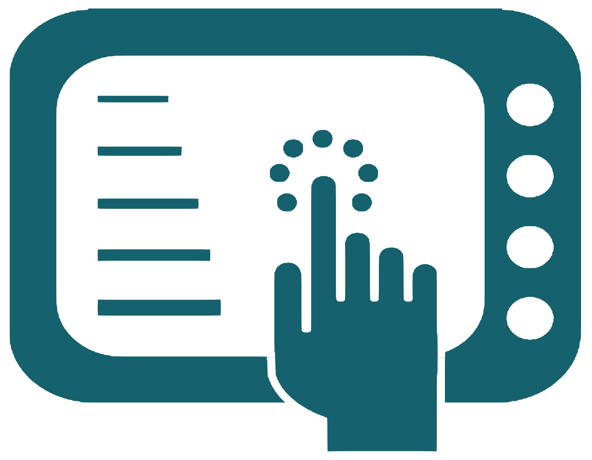

  
   
<h2 align="center">👋 Hello, I'm William 🫡</h2>

* 🫡 `My name is`: **William**
* 🐺 `I'm` : **25 Years Old**
* 💻 `Favorite lang`: **Python**
* 🤖 `Studies` : **Mechatronics Engineer Jr**
* 🌱 `Hobby` : **Programmer Jr**
  
😬 My English is not very good, but I try to improve 😄

I am a Jr Mechatronic Engineer with skills in mechanical, electronic design and control systems. My passion for programming has led me to study various types of languages such as Python, Java, JavaScript in addition to learning HTML, CSS and SQL databases. I am open to opportunities that allow me to apply my knowledge in engineering and programming individually or combined. My goal is to grow professionally by adding value to the organization.

 

-----------------

<h2 align="center"> 🫡 My Skills </h2>

<h3 align="center"> 🌱 Programming Languages </h3>

  | Python | Java | C | JavaScript |

 

 

<h3 align="center"> 🌱 Web Technologies </h3>

  | HTML | CSS | Bootstrap| Node Js |

 

 
 

 

<h3 align="center"> 🌱 Database</h3>

  | SQLite |

 

 

<h3 align="center"> 🌱 Mechatronics Skills </h3>

  | LabView | PLC | HMI | Microcontrollers |

 

 

 

 

  | SolidWorks |

 

 

-------------------

<h2 align="center"> 🎮 Statistics </h2>

 

-------------------
<h2 align="center"> 🌐 Social Media </h2>

**You can find me on:**

- X         : [**@SiegBoss**](https://twitter.com/SiegBoss)
- Instagram : [**@SiegBoss_xp**](https://www.instagram.com/siegboss_xp/)
- Tiktok    : [**@SiegBoss**](https://www.tiktok.com/@siegboss)
- Youtube   : [**@SiegBoss.**](https://www.youtube.com/channel/UCSW3q-yaw-yatKWJ1138Pkw)
- Twitch    : [**@SiegBoss**](https://www.twitch.tv/Siegboss)

