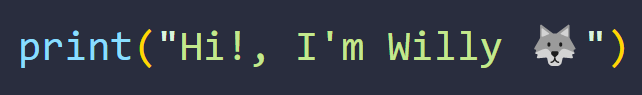
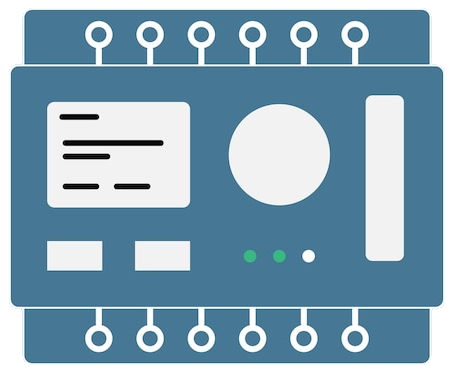
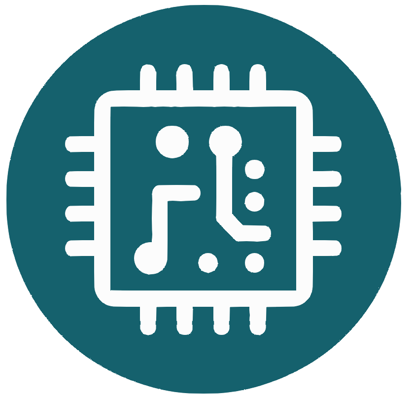

  
   
<h2 align="center">👋 Hello, I'm William 🫡</h2>

* 🫡 `My name is`: **William**
* 🐺 `I'm` : **25 Years Old**
* 💻 `Favorite lang`: **Python**
* 🤖 `Studies` : **Mechatronics Engineer**
* 🌱 `Hobby` : **Programming**
  
😬 My English is not very good, but I try to improve 😄

I really like programming, I am looking for a position where I can apply my programming knowledge and learn new technologies.
Although I have no previous work experience, I am looking forward to starting my career and contributing my knowledge and passion for programming.

-----------------
<h2 align="center"> 😼 My Skills </h2>

<h3 align="center"> 🌱 Programming languages (and html) </h3>

 
 
 
 

 

<h3 align="center"> 🌱 Frontend and Backend </h3>

 
 

 

<h3 align="center"> 🌱 Mobile App </h3>

 

 

<h3 align="center"> 🌱 Database</h3>

 

<h3 align="center"> 🌱 Other Skills </h3>

 

 

 
 

 

 

-------------------

<h2 align="center"> 🎮 Statistics </h2>

 

-------------------
<h2 align="center"> 🌐 Social Media </h2>

**You can find me on:**

- X         : [**@SiegBoss**](https://twitter.com/SiegBoss)
- Instagram : [**@SiegBoss_xp**](https://www.instagram.com/siegboss_xp/)
- Tiktok    : [**@SiegBoss**](https://www.tiktok.com/@siegboss)
- Youtube   : [**@SiegBoss.**](https://www.youtube.com/channel/UCSW3q-yaw-yatKWJ1138Pkw)
- Twitch    : [**@SiegBoss**](https://www.twitch.tv/Siegboss)

