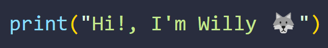
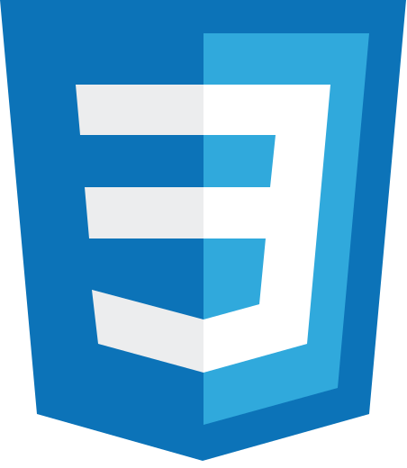

###  👋 Hello, I'm William 🫡, also known on the internet as SiegBoss 🐺.

 

🤖 I am a mechatronics engineer.  
🌱 I am a passionate software developer.  
My English is not very good, but I try to improve 😄

  

## ⚡Some of my Programming Skills.
   - Python
   - HTML
   - CSS
   - JavaScript
   - Java
   - Microcontrollers
   - PLC
   - HMI
   - LabVIEW

      

 

## 🤔 Other Skills
   - 2D Pixel Art
   - 3D Design in SolidWorks
   - Electrical Circuit Design
     
 

## 🌐 Social Media
You can find me on:
- X         : [**@SiegBoss**](twitter.com/SiegBoss)
- Instagram : [**@SiegBoss_**](instagram.com/siegboss_)
- Tiktok    : [**@SiegBoss**](https://www.tiktok.com/@siegboss)
- Youtube   : [**@SiegBoss.**](https://www.youtube.com/channel/UCSW3q-yaw-yatKWJ1138Pkw)

<!--
**SiegBoss/SiegBoss** is a ✨ _special_ ✨ repository because its `README.md` (this file) appears on your GitHub profile.

Here are some ideas to get you started:

- 🔭 I’m currently working on ...
- 🌱 I’m currently learning ...
- 👯 I’m looking to collaborate on ...
- 🤔 I’m looking for help with ...
- 💬 Ask me about ...
- 📫 How to reach me: ...
- 😄 Pronouns: ...
- ⚡ Fun fact: ...
-->
