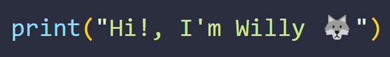

  
   
<h2 align="center">👋 Hola, Yo soy William 🫡</h2>

* 🫡 `Mi nombre es`: **William**
* 🐺 `Edad` : **28 años**
* 💻 `Mi Lenguaje Favorito es `: **Python**
* 🤖 `Estudios` : **Ingeniero Mecatrónico**
  

Profesional con experiencia en programación en diversos lenguajes como Python, C y JavaScript, así como en desarrollo web con HTML y CSS. Poseo habilidades en la implementación de sistemas, el manejo de bases de datos y el control de versiones con Git. Me adapto rápidamente a nuevas tecnologías y estoy comprometido con la creación de soluciones de software eficientes y de alta calidad.

 

-----------------

<h2 align="center"> 🫡 Mis Habilidades </h2>

<h3 align="center"> 🌱 Lenguajes de Programación </h3>

  | Python | C | JavaScript |

 

 

<h3 align="center"> 🌱 Tecnologias WEB </h3>

  | HTML | CSS |

 

 

 

<h3 align="center"> 🌱 Bases de Datos </h3>

  | SQLite | MongoDB | 

 

 

-------------------
<h2 align="center"> 🎮 Estadísticas </h2>

 

